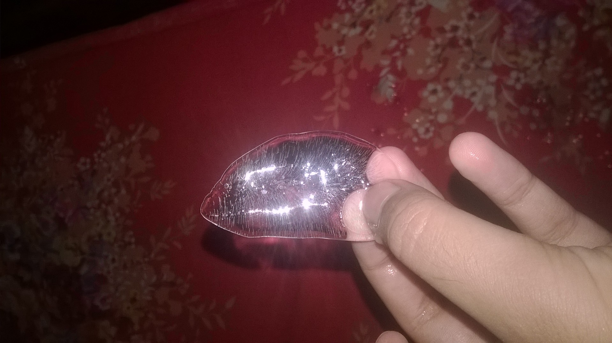

<!--markdown tutorial-->

Faria Anowara Adhora

<br/>
This is the beginning

---

# Adhora
## Adhora
### Adhora
#### Adhora
##### Adhora
###### Adhora

<p>I'm  Adhora,one of my greatest problems is I'm always angry and i don't like people.I love my hometown cumilla very much and also my country.Shayeri is my one of fav things</p>

<br/>

## italic text

_fateh milegi ek din jarur_

<br/>

## bold text

**parcham se bara koi kafan nehi hota**

<br/>

### Strikethorugh

~~india~~

<br/>

### single line code

`This is inline`  
` Bangladesh `  <br>
` Cumilla`

<br/>

### Multiple line code

```
  <html>
  <head> </head>
  <body> </body>
  </html>
```

```html
<html>
  <head> </head>
  <body></body>
</html>
```

```css
head {
  background-color: green;
}
```

```javascript
console.log("-.-");
```

<br/>

### Ordered List

1. Item1
2. Item2
   1. Item1.1
   2. Item1.2
3. Item3

<br/>

### Unordered List

- item1
  - item1.1
  - item1.2
- item2
- item3

<br/>

### Task List

- [a] Task1
- [b] Task1
- [] Task1

<br/>

### automatic link

https://www.rekhta.org/poets/akbar-allahabadi/t20

### disable link

`https://www.rekhta.org/poets/akbar-allahabadi/t20`

### markdown link sytax

[shayeri collection](https://www.rekhta.org/poets/akbar-allahabadi/t20)

### markdown link sytax with external

[shayeris][websitelink]

[pinterest][pinterestlink]

<br/>

### image sytax

<!--  -->


😊 <br>
💀
<br/>

### table sytax

| Name         | Email                  |
| ------------- |-----------------------|
| Faria| fariaanowara82@gmail.com       |
| Adhora| adhoraint62@gmail.com |


<!-- all link is here -->

[websitelink]: https://www.rekhta.org/poets/akbar-allahabadi/t20
[pinterestlink]: https://ph.pinterest.com/pin/65513369572013600/
